# DBS302 – Practical 3
## Design and Implement an E-Commerce Platform Schema in MongoDB


---

## 1. AIM

To design and implement an e-commerce platform schema using MongoDB, write advanced queries with the aggregation framework, and apply indexing and query analysis techniques to optimize performance for real-world workloads.

---

## 2. OBJECTIVES

The main objectives of this practical are:

- To design and create a MongoDB database schema for a simple e-commerce platform consisting of users, products, categories and orders collections.
- To insert sample data into the collections and understand how embedding and referencing works in MongoDB.
- To write aggregation queries to analyse sales data like daily revenue, top products and customer spending.
- To create indexes such as compound and text indexes to make queries faster.
- To use explain() to compare query speed before and after adding indexes.

---

## 3. TOOLS AND SOFTWARE USED

- MongoDB Atlas (Free Tier) – Cloud database
- mongosh 2.8.2 – MongoDB Shell

---

## 4. THEORY

### 4.1 MongoDB Data Modeling

MongoDB uses a flexible, document-oriented schema where data that is accessed together is stored together. For an e-commerce system, typical entities include users, products, orders, and categories.

There are two key modeling approaches:

- **Embedding** – Store related data inside the same document. Used when data is always accessed together and is bounded in size. Example: order items inside an order.
- **Referencing** – Store the ID of a related document instead of copying its data. Used when data is shared across many documents. Example: productId inside an order item referencing the products collection.

### 4.2 Aggregation Framework

The aggregation pipeline processes documents through a sequence of stages. Each stage transforms the data and passes it to the next stage. Key stages include:

- `$match` – Filter documents
- `$group` – Group and compute totals/averages
- `$project` – Choose which fields to show
- `$lookup` – Join data from another collection
- `$sort` – Sort results
- `$limit` – Limit number of results
- `$unwind` – Deconstruct array fields

### 4.3 Indexing and Query Optimization

Indexes are data structures that speed up queries by avoiding full collection scans. Key concepts:

- **COLLSCAN** – Collection scan, MongoDB reads every document (slow)
- **IXSCAN** – Index scan, MongoDB uses an index to find documents directly (fast)
- **ESR Rule** – Best practice for compound indexes: Equality → Sort → Range
- **explain()** – Shows the query execution plan and statistics

---

## 5. PROCEDURE

### Step 1: Connect to MongoDB Atlas

Connected to MongoDB Atlas Cluster0 using mongosh in VS Code terminal.

```bash
mongosh "mongodb+srv://cluster0.me0fez6.mongodb.net/" --apiVersion 1 --username 02230307cst
```

**Screenshot 1 – Successful Connection to Atlas:**

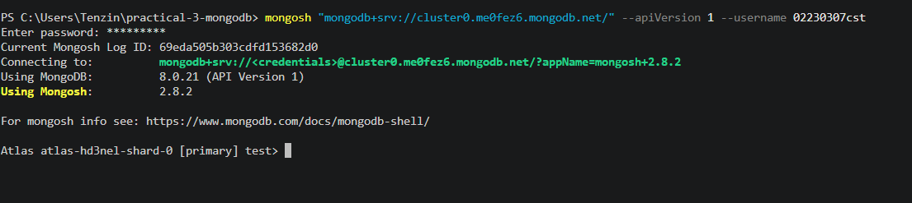


---

### Step 2: Create Database and Collections

Switched to the ecommerce database and created 4 collections.

```javascript
use ecommerce;
db.createCollection("users");
db.createCollection("categories");
db.createCollection("products");
db.createCollection("orders");
```

**Screenshot 2 – Collections Created:**

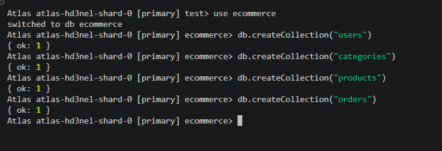

---

### Step 3: Insert Sample Data

#### 3.1 Insert Users

Two users were inserted into the users collection.

```javascript
db.users.insertMany([
  {
    name: "Tashi Dorji",
    email: "tashi@example.com",
    phone: "+975-17-123-456",
    address: {
      line1: "Building 12",
      city: "Thimphu",
      country: "Bhutan",
      postalCode: "11001"
    },
    createdAt: new Date("2026-04-18T08:00:00Z")
  },
  {
    name: "Sonam Choden",
    email: "sonam@example.com",
    phone: "+975-17-654-321",
    address: {
      line1: "Flat 3B",
      city: "Phuntsholing",
      country: "Bhutan",
      postalCode: "21001"
    },
    createdAt: new Date("2026-04-19T10:30:00Z")
  }
]);
```

**Screenshot 3 – Users Inserted:**

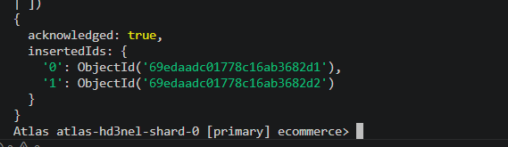

---

#### 3.2 Insert Categories

Two categories were inserted into the categories collection.

```javascript
db.categories.insertMany([
  { name: "Electronics", slug: "electronics", parentCategoryId: null },
  { name: "Accessories", slug: "accessories", parentCategoryId: null }
]);
```

**Screenshot 4 – Categories Inserted:**

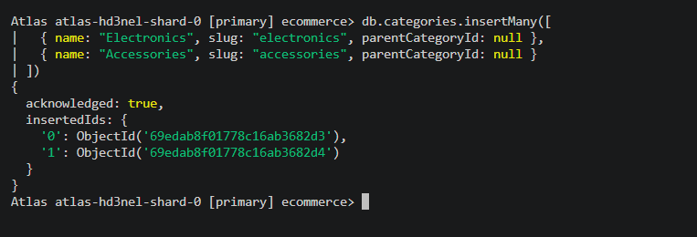

---

#### 3.3 Insert Products

Three products were inserted using the Attribute Pattern to store variable attributes.

```javascript
db.products.insertMany([
  {
    name: "Wireless Bluetooth Headphones",
    slug: "wireless-bluetooth-headphones",
    categoryId: ObjectId("69edab8f01778c16ab3682d3"),
    price: 129.99,
    currency: "USD",
    stock: 200,
    attributes: {
      brand: "Acme Audio",
      color: "black",
      wireless: true,
      batteryLifeHours: 24
    },
    tags: ["audio", "wireless", "headphones"],
    createdAt: new Date("2026-04-18T10:00:00Z")
  },
  {
    name: "USB-C Cable 1m",
    slug: "usb-c-cable-1m",
    categoryId: ObjectId("69edab8f01778c16ab3682d4"),
    price: 9.99,
    currency: "USD",
    stock: 500,
    attributes: {
      brand: "Acme Tech",
      lengthMeters: 1,
      color: "white"
    },
    tags: ["cable", "usb-c"],
    createdAt: new Date("2026-04-18T11:00:00Z")
  },
  {
    name: "Mechanical Keyboard",
    slug: "mechanical-keyboard",
    categoryId: ObjectId("69edab8f01778c16ab3682d3"),
    price: 79.99,
    currency: "USD",
    stock: 150,
    attributes: {
      brand: "Acme Input",
      layout: "US",
      switchType: "blue",
      backlight: true
    },
    tags: ["keyboard", "mechanical", "backlit"],
    createdAt: new Date("2026-04-19T09:00:00Z")
  }
]);
```

**Screenshot 5 – Products Inserted:**


---

#### 3.4 Insert Orders

Two orders were inserted with embedded order items.

```javascript
db.orders.insertMany([
  {
    userId: ObjectId("69edaadc01778c16ab3682d1"),
    status: "PAID",
    items: [
      {
        productId: ObjectId("69edb9dd01778c16ab3682da"),
        productName: "Wireless Bluetooth Headphones",
        unitPrice: 129.99,
        quantity: 2,
        lineTotal: 259.98
      },
      {
        productId: ObjectId("69edb9dd01778c16ab3682db"),
        productName: "USB-C Cable 1m",
        unitPrice: 9.99,
        quantity: 1,
        lineTotal: 9.99
      }
    ],
    grandTotal: 269.97,
    currency: "USD",
    createdAt: new Date("2026-04-19T15:30:00Z"),
    paymentMethod: "CARD"
  },
  {
    userId: ObjectId("69edaadc01778c16ab3682d2"),
    status: "PAID",
    items: [
      {
        productId: ObjectId("69edb9dd01778c16ab3682dc"),
        productName: "Mechanical Keyboard",
        unitPrice: 79.99,
        quantity: 1,
        lineTotal: 79.99
      }
    ],
    grandTotal: 79.99,
    currency: "USD",
    createdAt: new Date("2026-04-20T09:15:00Z"),
    paymentMethod: "COD"
  }
]);
```

**Screenshot 6 – Orders Inserted:**

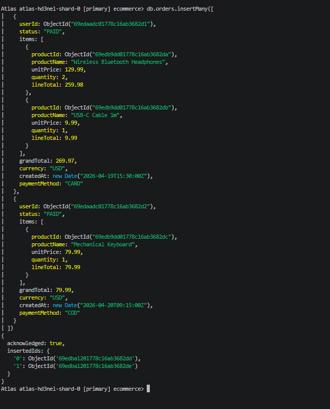

---

## 6. AGGREGATION QUERIES

### Query 1: Daily Sales Totals

This query computes total revenue and number of orders per day for completed (PAID) orders.

```javascript
db.orders.aggregate([
  { $match: { status: "PAID" } },
  {
    $group: {
      _id: {
        year: { $year: "$createdAt" },
        month: { $month: "$createdAt" },
        day: { $dayOfMonth: "$createdAt" }
      },
      totalRevenue: { $sum: "$grandTotal" },
      orderCount: { $sum: 1 }
    }
  },
  {
    $project: {
      _id: 0,
      date: {
        $dateFromParts: {
          year: "$_id.year",
          month: "$_id.month",
          day: "$_id.day"
        }
      },
      totalRevenue: 1,
      orderCount: 1
    }
  },
  { $sort: { date: 1 } }
]);
```

**Output:**
| Date | Total Revenue | Orders |
|---|---|---|
| 2026-04-19 | $269.97 | 1 |
| 2026-04-20 | $79.99 | 1 |

**Screenshot 7 – Query 1 Output:**

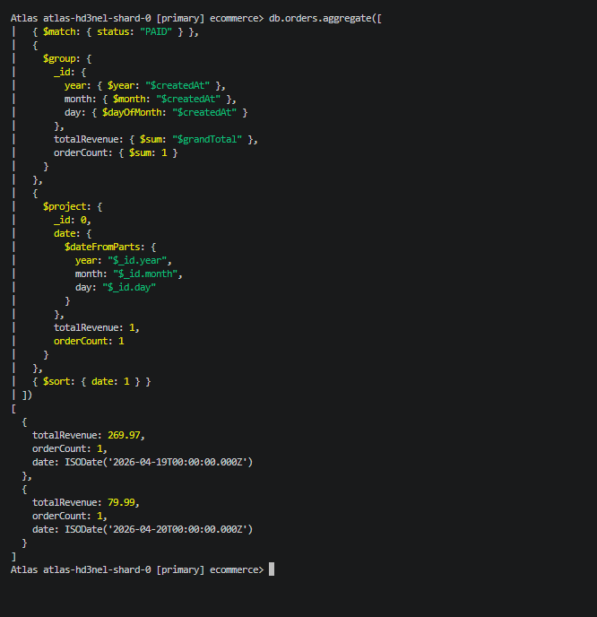

---

### Query 2: Top 5 Products by Revenue

This query finds the top 5 products by total revenue across all paid orders.

```javascript
db.orders.aggregate([
  { $match: { status: "PAID" } },
  { $unwind: "$items" },
  {
    $group: {
      _id: "$items.productId",
      productName: { $first: "$items.productName" },
      totalRevenue: { $sum: "$items.lineTotal" },
      totalQuantity: { $sum: "$items.quantity" }
    }
  },
  { $sort: { totalRevenue: -1 } },
  { $limit: 5 }
]);
```

**Output:**
| Rank | Product | Total Revenue | Qty Sold |
|---|---|---|---|
| 1 | Wireless Bluetooth Headphones | $259.98 | 2 |
| 2 | Mechanical Keyboard | $79.99 | 1 |
| 3 | USB-C Cable 1m | $9.99 | 1 |

**Screenshot 8 – Query 2 Output:**

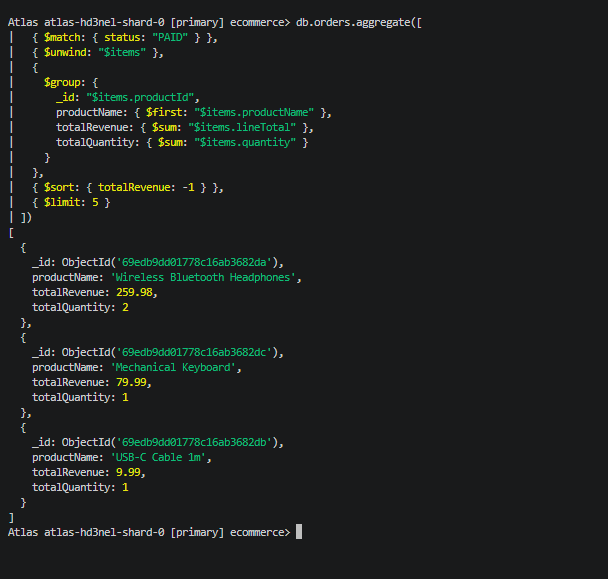

---

### Query 3: Average Order Value per User

This query computes average, min, and max order value for each user using $lookup to join with the users collection.

```javascript
db.orders.aggregate([
  { $match: { status: "PAID" } },
  {
    $group: {
      _id: "$userId",
      totalOrders: { $sum: 1 },
      totalSpent: { $sum: "$grandTotal" },
      minOrderValue: { $min: "$grandTotal" },
      maxOrderValue: { $max: "$grandTotal" },
      avgOrderValue: { $avg: "$grandTotal" }
    }
  },
  {
    $lookup: {
      from: "users",
      localField: "_id",
      foreignField: "_id",
      as: "user"
    }
  },
  { $unwind: "$user" },
  {
    $project: {
      _id: 0,
      userId: "$_id",
      userName: "$user.name",
      totalOrders: 1,
      totalSpent: 1,
      minOrderValue: 1,
      maxOrderValue: 1,
      avgOrderValue: 1
    }
  },
  { $sort: { totalSpent: -1 } }
]);
```

**Output:**
| Customer | Total Orders | Total Spent | Avg Order |
|---|---|---|---|
| Tashi Dorji | 1 | $269.97 | $269.97 |
| Sonam Choden | 1 | $79.99 | $79.99 |

**Screenshot 9 – Query 3 Output:**

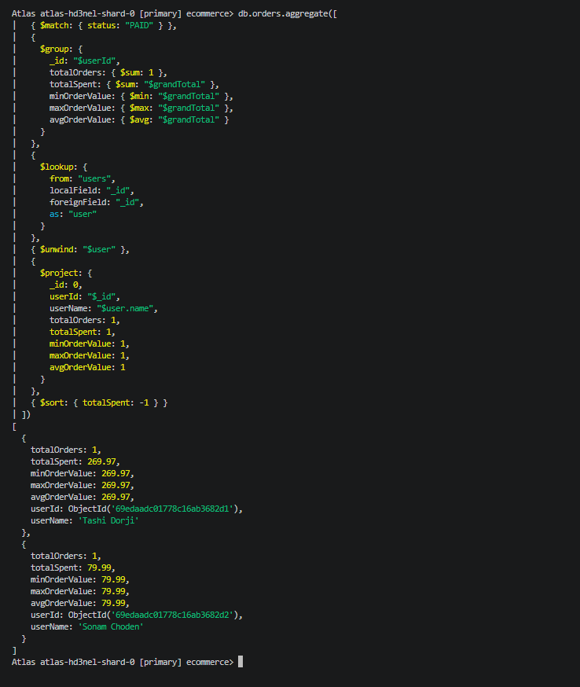

---

### Query 4: Product Catalog with Category Name

This query lists all products with their category names using $lookup to join products with categories.

```javascript
db.products.aggregate([
  {
    $lookup: {
      from: "categories",
      localField: "categoryId",
      foreignField: "_id",
      as: "category"
    }
  },
  { $unwind: "$category" },
  {
    $project: {
      _id: 0,
      name: 1,
      price: 1,
      "attributes.brand": 1,
      "attributes.color": 1,
      categoryName: "$category.name"
    }
  },
  { $sort: { categoryName: 1, name: 1 } }
]);
```

**Output:**
| Product | Price | Brand | Color | Category |
|---|---|---|---|---|
| USB-C Cable 1m | $9.99 | Acme Tech | white | Accessories |
| Mechanical Keyboard | $79.99 | Acme Input | - | Electronics |
| Wireless Headphones | $129.99 | Acme Audio | black | Electronics |

**Screenshot 10 – Query 4 Output:**

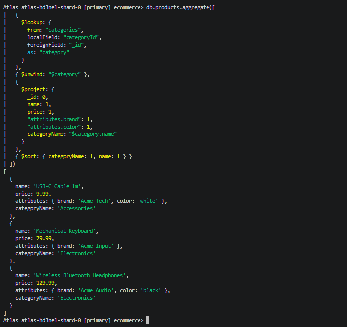

---

## 7. INDEXES

### Index 1: Orders by User and Date

Supports queries that fetch a specific user's orders sorted by newest first.

```javascript
db.orders.createIndex(
  { userId: 1, createdAt: -1 },
  { name: "idx_orders_user_createdAt" }
);
```

### Index 2: Orders by Status and Date (ESR Rule)

Supports filtering orders by status and date range. Follows ESR (Equality → Sort → Range) ordering.

```javascript
db.orders.createIndex(
  { status: 1, createdAt: -1, grandTotal: 1 },
  { name: "idx_orders_status_createdAt_grandTotal" }
);
```

### Index 3: Products by Category and Price

Supports browsing products by category sorted by price.

```javascript
db.products.createIndex(
  { categoryId: 1, price: 1 },
  { name: "idx_products_category_price" }
);
```

### Index 4: Text Index for Product Search

Enables full text search across product names and tags with weighted scoring.

```javascript
db.products.createIndex(
  { name: "text", tags: "text" },
  {
    name: "idx_products_text",
    weights: { name: 10, tags: 5 }
  }
);
```

**Screenshot 11 – All Indexes Created:**

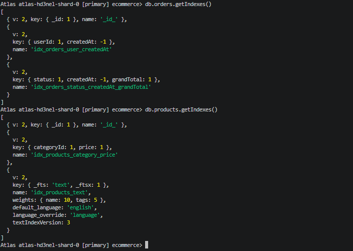
---

## 8. QUERY PERFORMANCE ANALYSIS USING explain()

### Before Index (COLLSCAN)

Using `$natural` hint to force a collection scan and simulate behaviour without an index.

```javascript
db.orders.find(
  { status: "PAID", createdAt: { $gte: new Date("2026-04-19") } }
).sort({ createdAt: -1 }).hint({ $natural: 1 }).explain("executionStats");
```

**Screenshot 12 – Before Index (COLLSCAN):**

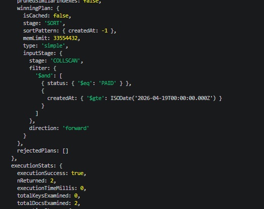

### After Index (IXSCAN)

Without the hint, MongoDB automatically uses the created index.

```javascript
db.orders.find(
  { status: "PAID", createdAt: { $gte: new Date("2026-04-19") } }
).sort({ createdAt: -1 }).explain("executionStats");
```

**Screenshot 13 – After Index (IXSCAN):**

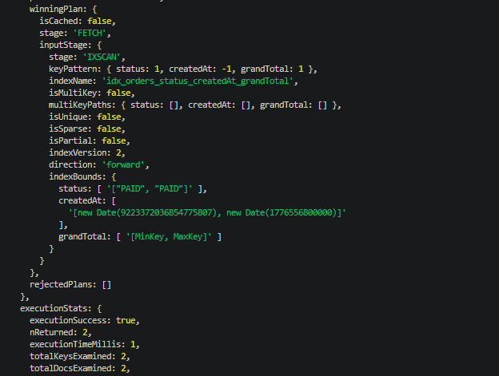

### Comparison

| | Before Index | After Index |
|---|---|---|
| Stage | COLLSCAN | IXSCAN |
| Index Used | None | idx_orders_status_createdAt_grandTotal |
| totalKeysExamined | 0 | 2 |
| executionTimeMillis | 0 | 1 |

After creating the index, MongoDB changed from COLLSCAN to IXSCAN. This means MongoDB now uses the index to find documents directly instead of checking every document one by one. In a real e-commerce system with millions of orders, using an index would make queries much faster.

---

## 9. CONCLUSION

In this practical, I learned how to design a MongoDB database for a simple e-commerce platform. I created 4 collections and inserted sample data, and understood the difference between embedding and referencing.
I wrote 4 aggregation queries to analyse sales data and used $lookup to join data from different collections. I also created 4 indexes and used explain() to compare query performance before and after indexing. I could clearly see that IXSCAN is faster than COLLSCAN because MongoDB uses the index instead of scanning every document.
Overall this practical helped me understand how MongoDB works in real world applications and why indexing is important for performance.

---

